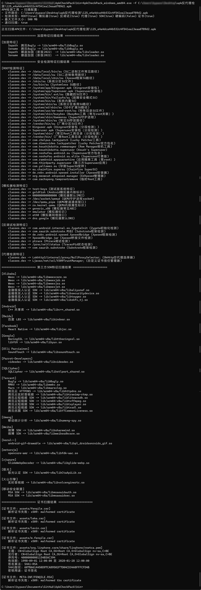
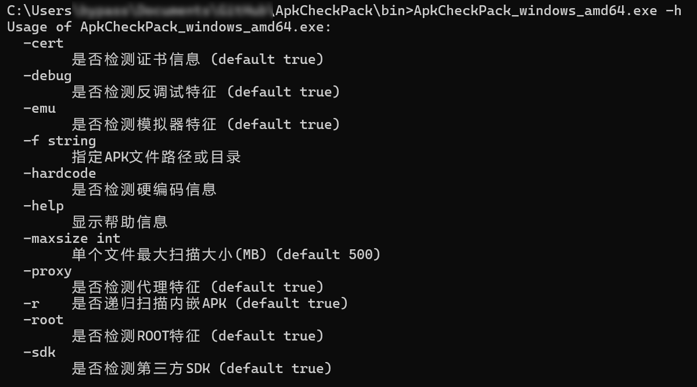

# ApkCheckPack

Welcome everyone to submit rules or report protected apps that cannot be identified (please provide a demo or a VT download hash). We aim to update quarterly.

Tools are only auxiliary. New techniques and vendors keep appearing, and signature/feature-based searches may miss things. Do not rely on them entirely.

Due to significant changes, the tool has been renamed to ApkCheckPack. It is likely the most comprehensive open-source tool for Android app protection/hardening rules.

We aggregate all protection indicators we can collect and support detection for 40 vendors. The data is stored in `apkpackdata.json` with the following fields. Feel free to use it if needed (protection rules updated: 2025-06-24; third-party SDK rules updated: 2024-09-22).

- `sopath` Absolute-path signature SO
- `soname` Signature SO filename only
- `other` Other signature files or strings
- `soregex` Regex for versioned signature SO libraries

Supported features

- √ Protection signature scan: compare protector SO library names/paths to determine if protection is present
- √ Anti-environment checks: scan DEX files for root, emulator, and anti-debugging detection
- √ Framework/SDK scan: scan signature SO names to detect third-party SDKs
- √ Anti-proxy detection: scan for proxy-detection class names to identify anti-proxy checks
- √ Embedded APK scan: some protectors embed multiple APK files inside the APK
- √ Certificate file scan: find certificate files by suffix and output their information
- X (temporarily removed) Signature verification: verify V2 signature to determine if the Janus vulnerability exists
- √ Secret leakage: scan APK contents for key-like strings

Implemented in Go; rules are bundled into a single executable for convenience.

Download the compiled binary from Releases and run it on a file or a directory (GUI version has been dropped).

Use the `-hardcode` parameter to enable full-file hardcoded-data scanning. Note the default limit scans up to 500 MB of internal files.

    ApkCheckPack.exe -hardcode true -f test.apk

